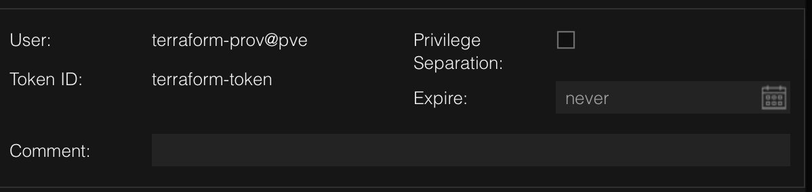

# TLDR

### add the user and role

```shell
pveum role add TerraformProv -privs "Datastore.AllocateSpace Datastore.Audit Pool.Allocate Sys.Audit Sys.Console Sys.Modify VM.Allocate VM.Audit VM.Clone VM.Config.CDROM VM.Config.Cloudinit VM.Config.CPU VM.Config.Disk VM.Config.HWType VM.Config.Memory VM.Config.Network VM.Config.Options VM.Migrate VM.Monitor VM.PowerMgmt SDN.Use"
pveum user add terraform-prov@pve --password <password>
pveum aclmod / -user terraform-prov@pve -role TerraformProv
```

### then create the token



### .env file content

```bash
TOKEN_ID=terraform-prov@pve!terraform-token
TOKEN_SECRET=xxxx-xxx-xx-xx-xxxxx
BASEAPI_URL=https://ip.address.fqdn:8006
```
